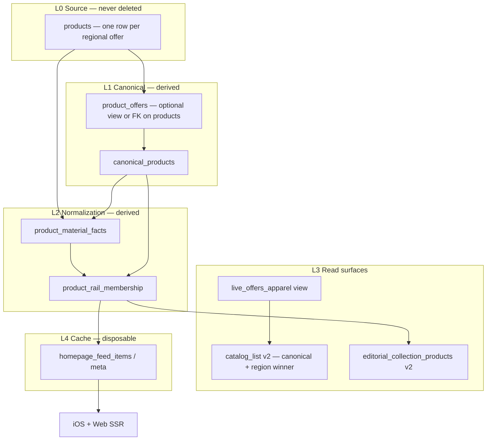

# Catalog normalization plan (preview only — no production apply)

**Rollout gates, migration sequence, rollback, IO estimates:** `docs/CATALOG_NORMALIZATION_ROLLOUT.md`

**Paused until ops priorities:** production stability, Disk IO recovery, Vercel visual check, homepage/material parity, iOS TestFlight.

**Principles**

- `products` rows stay the **raw feed + editorial source** (Rakuten/feeds). **No deletes.**
- US / UK / EU rows with different `product_id`, `url`, `price` are **offers**, not duplicates to remove.
- Approvals (`approved`, `tags`, `collection_slugs`) are **not** bulk-overwritten by feed sync (already enforced in `upsert_feed_products`).
- Canonical identity and rail membership are **derived layers** (tables/views), rebuilt from source data.

---

## Current architecture (as deployed + repo)

| Layer | Object | Role today |
|-------|--------|------------|
| L0 | `products` | One row per **feed `product_id`** (`ON CONFLICT (product_id)` in `20240002`). Includes `region`, `currency`, `url`, `price`, `composition`, `collection_slugs`, `material_metadata`, `approved`. |
| L1 | `live_products` | View: approved + active |
| L2 | `live_products_apparel` | View: women’s apparel gate |
| L3 | `catalog_dedupe_key()` + `catalog_region_rank()` | **Display-time** dedupe inside RPCs/refresh (not stored) |
| L4 | `catalog_list`, `editorial_collection_products` | Consumer reads; editorial slug + permissive predicates |
| L5 | `homepage_merch_rails`, `homepage_feed_items`, `homepage_feed_meta` | **Cache** for homepage/materials (you populated via per-rail refresh) |

**Gap vs target:** There is no persistent **canonical product id** or **offer → canonical** link. Fiber rails still use `composition ILIKE` and slug overlap; stale `collection_slugs` can disagree with composition until material-truth membership exists.

**Repo note:** Shared catalog migrations `20240006`–`20240015` are documented in `docs/SHARED_CATALOG.md` but may live only in Supabase (not all files are in this repo). Audits assume those functions/views already exist in production.

---

## Target architecture



### 1. Canonical product identity

One canonical row per **true style** (same garment), keyed by normalized:

| Signal | Use |
|--------|-----|
| Normalized image URL | Primary visual anchor (strip query params, CDN variants) |
| `brand_slug` + style base name | `homepage_style_base_name(name)` or equivalent |
| Composition fingerprint | Normalized fiber string / `material_metadata` |
| Retailer `product_id` | Tie-breaker only — **not** the canonical PK (varies by region) |

```text
canonical_products
  canonical_id          uuid PK
  style_key             text UNIQUE  -- stable hash of normalized signals
  brand_slug            text
  style_name            text         -- display
  image_url_norm        text
  composition_norm      text
  primary_fibers        text[]       -- {silk, wool, ...}
  natural_fiber_percent smallint
  first_seen_at         timestamptz
  updated_at            timestamptz
```

### 2. Regional offer layer

**Option A (minimal churn):** add nullable `canonical_id uuid` on `products`, keep all existing columns.

```text
products (unchanged semantics)
  id, product_id, region, url, price, currency, ...  -- each row = one offer
  canonical_id  uuid REFERENCES canonical_products  -- backfilled, never replaces product_id
```

**Option B (explicit):** `product_offers` view:

```sql
CREATE VIEW product_offers AS
SELECT id AS offer_id, canonical_id, product_id, region, url, price, currency, ...
FROM products WHERE canonical_id IS NOT NULL;
```

Region winner for display: same as today — `catalog_region_rank(region, p_preferred_region)` applied **per canonical_id**, not per `product_id`.

### 3. Material normalization

```text
product_material_facts
  canonical_id        uuid PK/FK
  primary_fiber       text   -- silk | linen | cashmere | wool | cotton | leather-suede | mixed
  fiber_tags          text[] -- all detected fibers
  leather_suede       boolean
  parsed_from         text   -- composition | material_metadata | both
  material_confidence smallint
  parsed_at           timestamptz
```

Parser rules (SQL or plpgsql):

- Input: `lower(composition)`, `material_metadata` JSON (`primary_material`, `materials[]`).
- Map synonyms: merino/lambswool → wool; flax → linen; suede/leather → leather-suede.
- **Do not** assign silk rail if composition is wool-only without silk (strict phase — preview counts first).

Indexes: `GIN (fiber_tags)`, btree `(primary_fiber)`, `(canonical_id)`.

### 4. Collection / rail membership

```text
product_rail_membership
  canonical_id   uuid
  rail_key       text   -- fabrics:silk, collections:vacation, sale:all, top:new_in
  source         text   -- material_truth | editorial_slug | sale_flag | new_in_rule
  priority       smallint
  active         boolean
  conflict_note  text   -- e.g. slug=silk-edit but composition lacks silk
  updated_at     timestamptz
  PRIMARY KEY (canonical_id, rail_key, source)
```

**Rules**

| Rail | Membership source | Slug override |
|------|-------------------|---------------|
| `fabrics:*` | `product_material_facts.primary_fiber` | Editorial slug may **add** candidates in preview; strict mode **drops** slug-only conflicts |
| `collections:*` | `editorial_collection_products` canonical slug | Material gate optional per collection |
| `sale:all` | `is_sale` + apparel gate | — |
| `top:new_in` | brand allowlist + recency | — |

Refresh `homepage_feed_items` from `product_rail_membership` + best regional offer, not from unbounded `live_products_apparel` ILIKE scans.

---

## Phase plan (approval gates)

| Phase | Work | Mutates data? |
|-------|------|----------------|
| **0** | Run `supabase/manual/audit_catalog_normalization_preview.sql` | No |
| **1** | Apply schema: `canonical_products`, `product_material_facts`, `product_rail_membership`, `products.canonical_id` | DDL only |
| **2** | Backfill canonical + offers (batch, resumable) | Yes — additive columns only |
| **3** | Build material facts + membership (rebuild job) | Yes — derived tables only |
| **4** | Point `refresh_homepage_feeds_v3` at membership layer | Cache only |
| **5** | Web/iOS read `catalog_list_v2` / membership-aware RPCs | App deploy |

**Stop gates:** preview counts must match expectations; Disk IO recovered enough for batch jobs; no approval field mass updates.

---

## What we are NOT doing

- Deleting “duplicate” `products` rows that differ by region
- `UPDATE products SET approved = …` in bulk
- Overwriting `composition`, `collection_slugs`, or feed fields from normalization
- Auto-running full `refresh_homepage_feeds_v2()` on a schedule (still manual / controlled)

---

## Refresh after normalization

1. Rebuild `product_rail_membership` from facts + editorial RPCs (bounded).
2. Run per-rail homepage refresh (existing `refresh_one_rail_at_a_time.sql`) **or** new `refresh_homepage_feeds_v3` reading membership.
3. Verify `homepage_feed_meta` + material pages + iOS `fetchMerchFeedProducts`.

---

## Related files

| File | Purpose |
|------|---------|
| `supabase/manual/audit_catalog_normalization_preview.sql` | Clusters, canonical preview, slug conflicts |
| `supabase/manual/audit_catalog_normalization_02_shadow_parity.sql` | Cache vs material-truth parity |
| `supabase/manual/audit_catalog_normalization_03_io_sizing.sql` | Batch / IO sizing |
| `supabase/proposed/20240019_catalog_canonical_layer_DRAFT.sql` | Schema draft — **do not apply** until approved |
| `docs/CATALOG_NORMALIZATION_ROLLOUT.md` | Phased sequence, rollback, cutover gates |
| `docs/SHARED_CATALOG.md` | Existing RPC/view layer |
| `docs/MERCHANDISING_AND_HOMEPAGE_FEEDS.md` | Rail cache layer |
