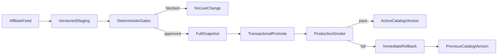

# INTERTEXE Production Reliability Release

**Status:** Approved (with final clarifications). Engineering-ready brief.  
**Principle:** Extend the existing stack. Do not replace it. Protect the catalog first, fix the visible commercial experience second, and treat rich push as incomplete until Apple credentials and physical-device testing are genuinely satisfied.

See also: `docs/CATALOG_INCIDENT_ROOT_CAUSE.md`, `docs/SALE_PIPELINE.md`

---

## Priorities

1. Prevent catalog wipe (staging safety, gates, snapshots, rollback, smoke, health score, AI verify)
2. Designer completeness / speed / pagination / shoe designers
3. Sale reliability across Sale, designer PLPs, search, rails
4. Rich image remote push (complement local + `user_push_tokens`)
5. Production QA before close

---

## Phase 1 — Establish verified baseline and protect current work

1. Audit existing uncommitted release work and run type/build/tests before extending it; preserve unrelated edits in both roots (website + iOS).
2. Validate the incident sequence using GitHub workflow history, `sync_logs`, `catalog_sync_runs`, `system_status`, migrations, and feed code; update `docs/CATALOG_INCIDENT_ROOT_CAUSE.md` with **only evidenced claims**.
3. Record production baseline counts by product, displayable product, merchant, designer, category, sale, rails, and collections in the final release record.

---

## Phase 2 — Complete P0 staging, promotion, snapshot, and rollback

1. Add migrations for staging sessions/rows, missing sync-run/event tables, promotion history, and full-row snapshots. Extend the existing snapshot schema rather than introducing a second catalog store.
2. Refactor `lib/feed-sync/rakuten-sync.js` and `lib/feed-sync/run-rakuten-chunk.ts` so ordinary runs write to a versioned staging session; **incomplete sessions never touch products**.
3. Implement a transactional promotion RPC/service that verifies completed file/chunk status, takes a full restorable snapshot, upserts the validated stage, applies only gated soft deactivation, advances `catalog_active_version`, and records the promotion.
4. Upgrade `lib/catalog-snapshot.ts` and `scripts/rollback-catalog-from-snapshot.mjs` from flag-only/capped restoration to **full prior-catalog restoration**.

### Ownership of the active catalog version

`catalog_active_version` must be the **single authoritative pointer** used by live reads. No customer-facing query should read unpromoted staging rows. Staging may exist alongside live data, but the live app must never query a mixed products/staging surface.

### Preserve editorial and manual curation fields during promotion

Promotion must preserve all manually curated and editorial fields unless the staged record explicitly contains an authorized curated update. Feed data must never overwrite founder/editorial decisions, including:

- `approved`
- `is_displayable`
- editorial placement
- pinned status
- custom copy
- collection membership
- manual material corrections

---

## Phase 3 — Finish deterministic gates, smoke tests, health score, and AI advisory

1. Harden `lib/catalog-health.ts`: global, merchant, designer, category, material, sale, expected-file/chunk, completion, timeout, rail, and trigger/constraint gates.
2. Make smoke checks assert **real content** for homepage, search, representative designers, material collections, Sale, scanner behavior, `/khiteri`, and a real PDP. Remove soft-passing of absent scanner coverage.
3. Run smoke immediately after promotion through `app/api/cron/catalog-promote-verify/route.ts`; on failure restore the exact pre-promotion snapshot and record/alert the rollback.
4. Persist one Catalog Health Score with component detail in `system_status`; surface it in the existing Today/Operations dashboard and create a high-priority `lib/dashboard/action-center.ts` item below 95%.
5. Extend the existing OpenAI/dashboard integration for advisory snapshot comparison (Expected, Needs review, Critical, recommendation). Store the report, never let AI override deterministic gates, and fail open if AI is unavailable.

### Rollback timing

A failed post-promotion smoke test must initiate rollback **automatically within the same release workflow**, not wait for the next cron or a manual review.

### Manual emergency stop

Add an emergency kill switch in `system_status` that prevents all feed promotion and deactivation while allowing reads and manual catalog operations to continue. One obvious switch for Cursor or a future developer to use immediately during an incident.

---

## Phase 4 — Prove P0 before restoring nightly sync

1. Add automated fixtures/tests for failed feed, partial feed, missing chunk, small/empty feed, global drop, merchant drop, idempotent rerun, stale lock, promotion, smoke failure, and rollback.
2. Apply migrations to production, deploy safety code, create and verify a baseline snapshot, then run controlled staging simulations against **non-live** sessions.
3. Re-enable `.github/workflows/rakuten-feed-sync.yml` only after all P0 acceptance tests pass; the workflow becomes stage → validate → promote → smoke, with **no direct production-ingest path**.

---

## Phase 5 — Complete designer coverage and performance

1. Extend the existing designer audit/alias tooling and `app/api/cron/sync-designers/route.ts`; correct missing aliases/status and derive shoe designers from verified catalog data.
2. Fix `collectBrandCatalogPage` to include eligible footwear while retaining natural-fiber apparel, preserve `gender_scope`, sale/full-price coexistence, filters, and reliable `hasMore`/`nextOffset` pagination.
3. Add/verify supporting indexes with query plans; keep short-lived success-only cache invalidated after promotion.
4. Verify at least ten designers, including shoe-focused and dual-gender Kiton, on web and iOS with first-load timing, pagination depth, counts, sale coexistence, and mens/kids exclusions.

### Designer counts and pagination source-consistency

Product count, first-page response, and pagination must derive from the **same eligibility logic**. Do not display a count from one query while retrieving products using different filters.

---

## Phase 6 — Normalize and expose sale inventory

1. Complete the merchant audit in `docs/SALE_PIPELINE.md`; confirm active MIDs and explicitly mark SSENSE out of scope unless an active feed/MID is found.
2. Consolidate sale normalization in feed merchant adapters using structured current/original price and flags; preserve MyTheresa region/currency handling and add schema fixtures per active merchant.
3. Ensure Sale, designer PLPs, search, category/material rails, favorites, and recommendations share normalized sale eligibility, badges, filters, and remote price refresh.
4. Extend the existing Founder Dashboard commerce metrics with sale counts and performance by merchant/designer/category; fix iOS server-side sort/pagination consistency.

### Price-history protection

Never overwrite the previous valid original price with the current discounted price. Preserve enough price history to detect genuine markdowns and avoid false price-drop notifications.

---

## Phase 7 — Complete rich remote push without replacing local notifications

1. Keep local welcome/scan schedulers and existing `user_push_tokens`; add migrations for multi-device tokens, notification events/attempts, preference-aware delivery, dedupe, retries, and price-drop event uniqueness.
2. Replace the current stub/deprecated-package dependency in `lib/push/apns-send.ts` with a tested token-auth APNs HTTP/2 sender; retain dry-run and development/production separation.
3. Consolidate existing price-drop detection into one event pipeline that fans out to existing email plus push; do not create a third detector. Add invalid-token cleanup, rate limits, transient retry, delivery logging, and controlled test dispatch.
4. Register the existing `NotificationService.swift` as a real Xcode Notification Service Extension target, enforce HTTPS/image MIME/size/time limits, and preserve text fallback.
5. Complete deep-link routing for product, Sale, `/khiteri`, designer, favorites, and scanner; consume pending product IDs so pushes open PDP rather than the Shop root.
6. Build/test sandbox and text/image fallback locally. Keep production APNs disabled until the `.p8`, Key ID, Team ID, and topic are supplied; provide exact Vercel/Apple handoff steps and then run the required physical-iPhone test.

### iOS compile gate before notification work

Resolve the current `ScannerView.swift` compile failure involving `.auto` before registering or testing the Notification Service Extension. **No iOS notification task is complete while the main app target fails to build.**

---

## Phase 8 — Production rollout and evidence-based closeout

1. Run typecheck, unit/integration tests, Next production build, iOS build, migration validation, controlled rollback, and browser/API smoke tests before deployment.
2. Apply production migrations and deploy in ordered phases: schema → P0 safety → baseline snapshot → controlled promotion → smoke/rollback proof → designer/sale → push dry-run.
3. Verify production URLs and APIs on desktop/mobile; record deployment SHA/build, migration IDs, timestamps, counts, timings, smoke output, health score, AI advisory, rollback evidence, designer audit, and sale audit in this document.
4. Do not claim production rich-push completion until Apple credentials and a physical-device image/deep-link test are available; report that external credential handoff precisely rather than saying it “should work.”

### Explicit forbid: automatic production rollout without evidence

Do not apply production migrations, re-enable nightly sync, or activate production APNs solely because code and local tests pass. **Each phase requires recorded evidence from the prior phase.**

---

## Key modules (existing / extend)

| Module | Path |
|---|---|
| Snapshots | `lib/catalog-snapshot.ts` |
| Health / smoke / AI verify | `lib/catalog-health.ts` |
| Pre-promote snapshot cron | `app/api/cron/catalog-snapshot` |
| Post-promote verify cron | `app/api/cron/catalog-promote-verify` |
| Cycle wiring | `lib/feed-sync/run-rakuten-chunk.ts` |
| Merchant drop gate | `lib/feed-sync/rakuten-sync.js` `markInactiveProducts` |
| Action Center | `lib/dashboard/action-center.ts` |
| Rollback CLI | `scripts/rollback-catalog-from-snapshot.mjs` |
| APNs sender | `lib/push/apns-send.ts` |
| Designer sync | `app/api/cron/sync-designers/route.ts` |
| Brand catalog page | `collectBrandCatalogPage` in `lib/supabase-server.ts` |

## Env flags

| Flag | Purpose |
|---|---|
| `CATALOG_ALLOW_MARK_INACTIVE=1` | Allow soft inactive (still gated) |
| `RAKUTEN_MARK_INACTIVE_ON_CYCLE=true` | Run inactive only on full cycle |
| `RAKUTEN_MAX_CATALOG_DROP_PCT` | Global drop % (default 5) |
| `CATALOG_MAX_MERCHANT_DROP_PCT` | Per-MID drop % (default 25) |
| `CATALOG_HEALTH_SCORE_THRESHOLD` | Default 95 |
| `CATALOG_SMOKE_AUTOROLLBACK=1` | Auto restore on smoke/gate failure |
| `PUSH_APNS_ENABLED=1` | Real APNs sends (keep off until credentials + device test) |
| `APNS_KEY_ID` / `APNS_TEAM_ID` / `APNS_BUNDLE_ID` / `APNS_KEY_P8` | APNs token auth |
| `APNS_PRODUCTION=1` | Production APNs gateway |

## Do not re-enable nightly GHA schedule until

- Failed + incomplete feed simulations leave production unchanged
- Merchant drop blocked in test
- Rollback tested from row-level snapshot
- Root-cause OPEN log artifacts attached
- Production baseline counts recorded
- Post-promote smoke auto-rollback proven in the same workflow

---

## Execution protocol (mandatory)

Execute this release **in phases**. After each phase, stop and return:

- files changed
- migrations created or applied
- tests run
- production evidence
- blockers
- exact next step

**Do not** silently skip an acceptance criterion.  
**Do not** mark a phase complete when validation is unavailable.  
**Do not** alter unrelated features while completing this release.

---

## Release evidence log

| Phase | Completed | Evidence | Blockers |
|---|---|---|---|
| 1 Baseline | | | |
| 2 Staging/promote/rollback | | | |
| 3 Gates/smoke/health/AI | | | |
| 4 P0 proof / nightly sync | | | |
| 5 Designer | | | |
| 6 Sale | | | |
| 7 Rich push | | | |
| 8 Production closeout | | | |

### Production baseline counts (Phase 1)

| Metric | Count | Captured at (UTC) | Source |
|---|---|---|---|
| products | | | |
| displayable products | | | |
| merchants | | | |
| designers | | | |
| categories | | | |
| sale-eligible | | | |
| rails | | | |
| collections | | | |
